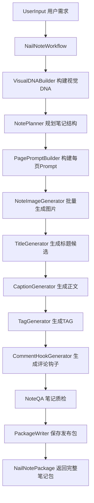

# **PRD：Nail 垂直行业小红书图文笔记生产系统**

版本：v1.0  
日期：2026-04-28  
项目：`xhs_nail_agent`  
模块范围：`verticals/nail/`、`orchestrator_v2.py`、`project_paths.py`、`output/`、`case_library/`  
目标状态：从“单张美甲封面图生成器”升级为“完整小红书美甲图文笔记生产工作流”。

---

## **1. 背景**

当前项目已经具备通用图片生成能力，并在 `verticals/nail/` 下初步建立了美甲垂直行业工作流。现有 nail workflow 可以根据用户输入生成小红书美甲封面图，并能通过 `MultiAgentImageRunner` 桥接到通用 `orchestrator_v2.run()`。

但是，当前能力仍然偏向“单图生成”。对于真实的小红书图文笔记生产来说，仅生成一张首页封面图是不够的。一篇完整的小红书美甲爆款笔记通常需要封面图、内页图、细节图、对比图、款式解析图、避雷说明图、收藏总结图、爆款标题、正文文案、标签、评论钩子、发布检查等完整素材。

因此，nail 垂类需要从“生成一张图”升级为“生成一篇笔记”。通用 `orchestrator_v2.py` 继续负责单张图片生成，`verticals/nail/` 负责上层笔记策划、多页图像编排、标题文案生成、TAG 生成、质检和发布包归档。

---

## **2. 产品目标**

本 PRD 的目标是设计并实现一个面向小红书美甲图文场景的端到端内容生产系统。

用户输入一句美甲需求，以及可选的参考图、风格、肤色、甲型、笔记目标后，系统应自动生成一整套小红书图文笔记发布包。

最小可用目标如下：

```text
输入：
夏日蓝色猫眼短甲，适合黄皮，显白清透

输出：
1. 6 到 7 页小红书图文笔记图片
2. 每页图片对应的页面角色、视觉目标、生成 Prompt、页内文案建议
3. 10 个爆款标题候选
4. 1 篇完整小红书正文
5. 15 到 25 个推荐 TAG
6. 3 到 5 个评论区互动钩子
7. note_package.json 发布包
8. archive.json 归档文件
```

系统最终应支持“以始为终”的内容生成方式：不是先生成图再临时补文案，而是先明确笔记目标、用户心理、页面结构、传播任务，再生成每一页所需图片与文案。

---

## **3. 核心原则**

### **3.1 通用图片生成与垂类笔记编排分离**

`orchestrator_v2.py` 不应被改造成小红书专用系统。它应该继续保持通用单图生成能力，负责：

- 文生图；
- 图生图；
- 输出落盘；
- 单图 QA；
- 单图归档；
- 案例库保存。

`verticals/nail/` 应作为上层业务编排层，负责：

- 选题定位；
- 笔记结构规划；
- 多页页面脚本生成；
- 每页图像 Prompt 构建；
- 批量调用单图生成；
- 标题、正文、TAG 生成；
- 整篇笔记质检；
- 发布包归档。

### **3.2 以整篇笔记为最终产物**

当前的最终产物是单张图片。新系统的最终产物应是 `NailNotePackage`，也就是一整篇小红书图文笔记发布包。

系统不能只返回：

```python
{
    "success": True,
    "filepath": "output/xxx.png"
}
```

而应返回：

```python
{
    "success": True,
    "note_id": "nail_20260428_224228_summer_blue_cat_eye",
    "output_dir": "output/nail_20260428_224228_summer_blue_cat_eye",
    "pages": [...],
    "title_candidates": [...],
    "selected_title": "...",
    "body": "...",
    "tags": [...],
    "comment_hooks": [...],
    "package_path": "output/.../note_package.json"
}
```

### **3.3 每一页都必须有传播任务**

多页图文不能只是生成多张相似美图。每一页都必须有明确角色，例如：

- 第 1 页负责点击；
- 第 2 页负责展示质感；
- 第 3 页负责解决肤色顾虑；
- 第 4 页负责提供复刻信息；
- 第 5 页负责增加场景代入；
- 第 6 页负责避雷；
- 第 7 页负责促收藏。

页面角色必须写入 `note_package.json`，并参与 Prompt 构建和 QA。

### **3.4 视觉 DNA 必须贯穿整篇笔记**

多页图文必须保持一致性。系统需要维护一个 `visual_dna` 对象，用来保证肤色、手型、甲型、颜色、质感、光线、背景和画风的一致。

例如：

```json
{
  "skin_tone": "黄皮",
  "hand_model": "自然亚洲女性手型",
  "nail_length": "短甲",
  "nail_shape": "短方圆",
  "main_color": "清透冰蓝",
  "finish": "猫眼磁粉，玻璃感，高光泽",
  "lighting": "夏日自然光",
  "background": "干净浅色背景",
  "style": "小红书清透种草风",
  "negative": ["长尖甲", "暗沉灰蓝", "欧美夸张风", "廉价闪粉"]
}
```

每一页生成时都应继承该 DNA，只在页面角色和局部构图上变化。

### **3.5 爆款不是承诺结果，而是内容结构优化目标**

系统可以生成“爆款标题”“爆款文案”“爆款结构”，但不应承诺一定爆。系统目标是根据小红书图文内容规律，提高点击、滑动、收藏、评论和复刻价值的概率。

因此，代码和文档中可以使用“爆款候选”“爆款结构”“高点击标题候选”等表述，但最终验收应基于产物完整性、结构合理性和素材可用性，而不是实际平台数据。

---

## **4. 用户画像与使用场景**

### **4.1 目标用户**

本系统面向以下使用者：

- 美甲博主；
- 美甲店运营；
- 小红书内容运营；
- 美甲款式素材生产者；
- AI 内容工作流开发者；
- 批量生成美甲图文笔记素材的自动化系统。

### **4.2 核心使用场景**

用户希望输入一句自然语言需求，例如：

```text
夏日蓝色猫眼短甲，适合黄皮，显白清透
```

系统自动生成完整笔记素材，包括多页图像、标题、正文和标签。

用户也可以指定更明确的信息：

```python
UserInput(
    brief="夏日蓝色猫眼短甲，适合黄皮，显白清透",
    style_id="single_seed_summer_cat_eye_short",
    skin_tone="黄皮",
    nail_length="短甲",
    nail_shape="短方圆",
    note_goal="seed",
    page_count=7,
    allow_text_on_image=True,
    reference_image_path="case_library/poster/case_001_xxx/image.png"
)
```

系统输出一个可发布或可人工微调的小红书图文笔记包。

---

## **5. 范围**

### **5.1 本期范围**

本期需要实现：

- 新增 `NailNoteWorkflow`；
- 新增笔记级 Schema；
- 新增笔记结构规划器；
- 新增页面脚本生成器；
- 新增页面 Prompt 构建器；
- 新增多页图像生成编排；
- 新增标题生成器；
- 新增正文生成器；
- 新增 TAG 生成器；
- 新增评论钩子生成器；
- 新增笔记发布包归档；
- 新增基础 QA；
- 输出 `note_package.json`；
- 输出多页图片到独立 note 目录。

### **5.2 暂不包含范围**

本期不要求实现：

- 自动发布到小红书；
- 登录账号；
- 平台数据抓取；
- 真实发布后的点击率、收藏率、评论率分析；
- 基于真实平台数据的标题模型训练；
- 复杂视觉模型自动评分；
- 完整 A/B 测试平台；
- 多账号矩阵投放。

这些能力可以作为后续阶段扩展。

---

## **6. 功能需求**

## **6.1 新增笔记级入口：NailNoteWorkflow**

需要在 `verticals/nail/` 下新增：

```text
verticals/nail/note_workflow.py
```

核心类：

```python
class NailNoteWorkflow:
    def generate_note(self, user_input: UserInput) -> NailNotePackage:
        ...
```

该入口负责完整编排：

```text
UserInput
→ 视觉 DNA 构建
→ 笔记结构规划
→ 页面脚本生成
→ 每页 Prompt 构建
→ 多页图片生成
→ 标题生成
→ 正文生成
→ TAG 生成
→ 评论钩子生成
→ QA
→ 保存 note_package.json
→ 返回 NailNotePackage
```

`NailNoteWorkflow` 不直接调用外部图片 API，而是通过现有 `MultiAgentImageRunner` 或类似 adapter 调用 `orchestrator_v2.run()`。

---

## **6.2 扩展 UserInput Schema**

需要在 `verticals/nail/schemas.py` 中扩展 `UserInput`。

建议新增字段：

```python
class UserInput(BaseModel):
    brief: str

    style_id: str | None = None
    skin_tone: str | None = None
    nail_length: str | None = None
    nail_shape: str | None = None

    note_goal: str = "seed"
    note_template: str | None = None
    page_count: int = 6

    allow_text_on_image: bool = False
    reference_image_path: str | None = None
    case_id: str | None = None

    generate_images: bool = True
    generate_copy: bool = True
    generate_tags: bool = True

    quality: str = "final"
    aspect: str = "3:4"
    direction: str = "balanced"
```

字段说明：

| 字段 | 类型 | 说明 |
|---|---|---|
| `brief` | `str` | 用户核心需求 |
| `style_id` | `str \| None` | 已有美甲款式 ID |
| `skin_tone` | `str \| None` | 肤色，例如黄皮、冷白皮、自然肤色 |
| `nail_length` | `str \| None` | 甲长，例如短甲、中长甲 |
| `nail_shape` | `str \| None` | 甲型，例如短方圆、椭圆、杏仁形 |
| `note_goal` | `str` | 笔记目标 |
| `note_template` | `str \| None` | 指定笔记模板 |
| `page_count` | `int` | 生成页数，默认 6 |
| `allow_text_on_image` | `bool` | 是否允许图内文字 |
| `reference_image_path` | `str \| None` | 用户指定参考图 |
| `case_id` | `str \| None` | 案例库参考图 ID |
| `generate_images` | `bool` | 是否实际生成图片 |
| `generate_copy` | `bool` | 是否生成标题正文 |
| `generate_tags` | `bool` | 是否生成 TAG |
| `quality` | `str` | 图片质量档位 |
| `aspect` | `str` | 图片比例，默认 3:4 |
| `direction` | `str` | 风格方向 |

---

## **6.3 新增笔记目标 NoteGoal**

需要支持至少以下笔记目标：

```python
class NoteGoal(str, Enum):
    seed = "seed"
    tutorial = "tutorial"
    comparison = "comparison"
    warning = "warning"
    collection = "collection"
    conversion = "conversion"
```

说明：

| note_goal | 中文含义 | 主要传播目标 |
|---|---|---|
| `seed` | 种草 | 点击、心动、收藏 |
| `tutorial` | 教程 | 步骤、实用、收藏 |
| `comparison` | 对比测评 | 解决选择困难 |
| `warning` | 避雷 | 避免翻车、制造实用价值 |
| `collection` | 合集 | 多款选择、收藏 |
| `conversion` | 给美甲师看 | 帮用户复刻、促转化 |

---

## **6.4 新增页面角色 PageRole**

需要支持至少以下页面角色：

```python
class PageRole(str, Enum):
    cover = "cover"
    detail_closeup = "detail_closeup"
    skin_tone_fit = "skin_tone_fit"
    style_breakdown = "style_breakdown"
    scene_mood = "scene_mood"
    avoid_mistakes = "avoid_mistakes"
    save_summary = "save_summary"
    materials = "materials"
    step_by_step = "step_by_step"
    comparison_grid = "comparison_grid"
    collection_grid = "collection_grid"
```

说明：

| page_role | 中文含义 | 页面任务 |
|---|---|---|
| `cover` | 封面 | 抓点击 |
| `detail_closeup` | 近景细节 | 展示甲面质感 |
| `skin_tone_fit` | 肤色适配 | 解决显白/显黑顾虑 |
| `style_breakdown` | 款式拆解 | 提供复刻关键词 |
| `scene_mood` | 场景氛围 | 增加生活方式代入 |
| `avoid_mistakes` | 避雷建议 | 增加实用价值 |
| `save_summary` | 收藏总结 | 促收藏、促转发 |
| `materials` | 材料页 | 教程类笔记使用 |
| `step_by_step` | 步骤页 | 教程类笔记使用 |
| `comparison_grid` | 对比页 | 测评、避雷类笔记使用 |
| `collection_grid` | 合集页 | 多款合集使用 |

---

## **6.5 新增笔记级数据结构**

需要在 `verticals/nail/schemas.py` 中新增以下结构。

### **6.5.1 VisualDNA**

```python
class VisualDNA(BaseModel):
    skin_tone: str | None = None
    hand_model: str | None = None
    nail_length: str | None = None
    nail_shape: str | None = None
    main_color: str | None = None
    finish: str | None = None
    lighting: str | None = None
    background: str | None = None
    style: str | None = None
    negative: list[str] = []
    source_reference: str | None = None
```

用途：

- 统一多页图像风格；
- 继承参考图特征；
- 避免每页手型、肤色、甲型漂移；
- 给页面 Prompt 构建器提供稳定上下文。

### **6.5.2 NotePageSpec**

```python
class NotePageSpec(BaseModel):
    page_no: int
    role: PageRole
    goal: str

    visual_brief: str
    text_overlay: str | None = None
    caption: str | None = None

    prompt: str | None = None
    negative_prompt: str | None = None

    image_path: str | None = None
    image_url: str | None = None
    used_reference: bool = False

    status: str = "planned"
    score: float | None = None
    issues: list[str] = []
```

页面状态建议：

```text
planned
prompt_ready
generated
failed
skipped
```

### **6.5.3 NailNotePackage**

```python
class NailNotePackage(BaseModel):
    note_id: str
    brief: str
    style_id: str | None = None
    note_goal: NoteGoal = NoteGoal.seed
    note_template: str | None = None

    visual_dna: VisualDNA
    pages: list[NotePageSpec]

    title_candidates: list[str] = []
    selected_title: str | None = None
    body: str | None = None
    tags: list[str] = []
    comment_hooks: list[str] = []

    output_dir: str | None = None
    package_path: str | None = None
    archive_path: str | None = None

    success: bool = False
    partial_failure: bool = False
    diagnostics: dict = {}
```

---

## **6.6 笔记模板系统**

需要新增：

```text
verticals/nail/note_templates.py
```

模板负责根据 `note_goal` 或 `style_id` 生成默认页面结构。

### **6.6.1 单款种草模板**

适用于：

```text
single_seed_summer_cat_eye_short
```

默认页面结构：

```python
SINGLE_STYLE_SEED_TEMPLATE = [
    "cover",
    "detail_closeup",
    "skin_tone_fit",
    "style_breakdown",
    "scene_mood",
    "save_summary"
]
```

如果 `page_count=7`，可加入：

```python
"avoid_mistakes"
```

推荐 7 页结构：

| 页码 | 页面角色 | 页面任务 |
|---|---|---|
| 1 | `cover` | 抓点击，展示最终效果 |
| 2 | `detail_closeup` | 展示猫眼光泽、甲面质感 |
| 3 | `skin_tone_fit` | 说明黄皮显白逻辑 |
| 4 | `style_breakdown` | 拆解颜色、甲型、质感 |
| 5 | `scene_mood` | 展示夏日通勤/约会/旅行场景 |
| 6 | `avoid_mistakes` | 避免显黑蓝、过多贴钻、过长甲型 |
| 7 | `save_summary` | 给美甲师看的收藏总结 |

### **6.6.2 教程模板**

适用于：

```text
tutorial_diy_step_by_step
```

默认页面结构：

```python
TUTORIAL_TEMPLATE = [
    "cover",
    "materials",
    "step_by_step",
    "step_by_step",
    "step_by_step",
    "avoid_mistakes",
    "save_summary"
]
```

### **6.6.3 合集模板**

适用于：

```text
collection_cover_6_grid_whitening
```

默认页面结构：

```python
COLLECTION_TEMPLATE = [
    "cover",
    "collection_grid",
    "detail_closeup",
    "skin_tone_fit",
    "style_breakdown",
    "save_summary"
]
```

### **6.6.4 避雷模板**

适用于：

```text
warning_before_after_nail_fail
```

默认页面结构：

```python
WARNING_TEMPLATE = [
    "cover",
    "comparison_grid",
    "avoid_mistakes",
    "skin_tone_fit",
    "style_breakdown",
    "save_summary"
]
```

---

## **6.7 视觉 DNA 构建器**

需要新增：

```text
verticals/nail/visual_dna_builder.py
```

核心函数：

```python
def build_visual_dna(user_input: UserInput) -> VisualDNA:
    ...
```

规则：

1. 如果用户提供 `reference_image_path`，应优先从参考图 DNA 中提取视觉特征。
2. 如果用户提供 `case_id`，应通过案例库解析参考图，再构建 DNA。
3. 如果没有参考图，则从 `brief`、`skin_tone`、`nail_length`、`nail_shape`、`style_id` 推断默认 DNA。
4. 所有页面必须继承同一个 `visual_dna`。

默认示例：

```python
VisualDNA(
    skin_tone=user_input.skin_tone or "自然偏黄皮",
    hand_model="自然亚洲女性手型",
    nail_length=user_input.nail_length or "短甲",
    nail_shape=user_input.nail_shape or "短方圆",
    main_color="清透冰蓝",
    finish="猫眼磁粉，玻璃感，高光泽",
    lighting="夏日自然光，柔和明亮",
    background="干净浅色背景，小红书风格",
    style="清透、显白、日常、精致",
    negative=["长尖甲", "暗沉灰蓝", "欧美夸张风", "廉价闪粉", "过度磨皮"]
)
```

---

## **6.8 笔记规划器 NotePlanner**

需要新增：

```text
verticals/nail/note_planner.py
```

核心函数：

```python
def plan_note(user_input: UserInput, visual_dna: VisualDNA) -> list[NotePageSpec]:
    ...
```

职责：

- 根据 `note_goal`、`style_id`、`page_count` 选择模板；
- 生成每页的 `role`；
- 生成每页的 `goal`；
- 生成每页的 `visual_brief`；
- 生成每页的 `text_overlay`；
- 生成每页的 `caption`。

示例输出：

```python
[
    NotePageSpec(
        page_no=1,
        role="cover",
        goal="提高点击率，让用户一眼看到清透显白的夏日蓝色猫眼短甲效果",
        visual_brief="小红书美甲笔记封面图，黄皮手模，短方圆甲型，清透冰蓝猫眼，夏日自然光，干净浅色背景，高级清透",
        text_overlay="黄皮也能冲的蓝猫眼",
        caption="第一眼就很清透的夏日蓝猫眼"
    ),
    NotePageSpec(
        page_no=2,
        role="detail_closeup",
        goal="展示猫眼磁粉光带、玻璃感和甲面细节",
        visual_brief="蓝色猫眼短甲近景细节图，突出磁粉光带、甲面弧度、玻璃感和高光泽",
        text_overlay="近看是这种玻璃猫眼感",
        caption="细看有一条很干净的猫眼光带"
    )
]
```

---

## **6.9 页面 Prompt 构建器**

需要新增：

```text
verticals/nail/page_prompt_builder.py
```

核心函数：

```python
def build_page_prompt(
    page: NotePageSpec,
    visual_dna: VisualDNA,
    user_input: UserInput
) -> str:
    ...
```

Prompt 必须包含：

- 页面角色；
- 页面目标；
- 用户 brief；
- 视觉 DNA；
- 页面 visual_brief；
- 构图要求；
- 小红书图文风格；
- 禁止项；
- 是否允许图内文字；
- 如果允许图内文字，文字必须短、清晰、无错别字。

Prompt 示例结构：

```text
你正在生成一页小红书美甲图文笔记图片。

页面信息：
- 页码：1
- 页面角色：封面
- 页面目标：提高点击率，让用户一眼看到清透显白的夏日蓝色猫眼短甲效果

核心主题：
夏日蓝色猫眼短甲，适合黄皮，显白清透

视觉 DNA：
- 肤色：黄皮
- 手型：自然亚洲女性手型
- 甲长：短甲
- 甲型：短方圆
- 主色：清透冰蓝
- 质感：猫眼磁粉，玻璃感，高光泽
- 光线：夏日自然光，柔和明亮
- 背景：干净浅色背景，小红书风格

画面要求：
生成小红书美甲笔记封面图，画面高级、干净、清透，突出蓝色猫眼短甲的显白效果。
构图应适合 3:4 竖版封面，主体清晰，手部自然，甲面质感真实。

图内文字：
允许图内文字。文字为：黄皮也能冲的蓝猫眼
文字必须简短、清晰、无错别字，不要遮挡甲面主体。

禁止：
不要长尖甲，不要暗沉灰蓝，不要欧美夸张风，不要廉价闪粉，不要多余手指，不要畸形手部，不要过度磨皮。
```

---

## **6.10 多页图像生成器**

需要新增或扩展：

```text
verticals/nail/note_image_generator.py
```

核心函数：

```python
def generate_note_images(
    pages: list[NotePageSpec],
    user_input: UserInput,
    visual_dna: VisualDNA,
    output_dir: str
) -> list[NotePageSpec]:
    ...
```

职责：

- 遍历每个 `NotePageSpec`；
- 为每一页构建 Prompt；
- 调用 `MultiAgentImageRunner` 或 `orchestrator_v2.run()`；
- 每页输出独立图片；
- 将图片路径写回 `page.image_path`；
- 将是否使用参考图写回 `page.used_reference`；
- 失败时记录 `page.status="failed"` 和 `page.issues`；
- 不因单页失败导致全局崩溃，除非封面页失败。

### **6.10.1 输出路径规则**

每篇笔记必须生成独立输出目录：

```text
output/
└── nail_20260428_224228_summer_blue_cat_eye/
    ├── page_01_cover.png
    ├── page_02_detail_closeup.png
    ├── page_03_skin_tone_fit.png
    ├── page_04_style_breakdown.png
    ├── page_05_scene_mood.png
    ├── page_06_save_summary.png
    ├── note_package.json
    └── archive.json
```

图片路径应优先保存为项目相对路径：

```text
output/nail_20260428_224228_summer_blue_cat_eye/page_01_cover.png
```

不得保存为旧路径：

```text
~/.hermes/agents/multi-agent-image/output/...
```

不得保存为用户本机绝对路径：

```text
/Users/wiwi/...
```

### **6.10.2 调用单图生成时的参数**

调用 `orchestrator_v2.run()` 时应尽量使用：

```python
run(
    user_input=page.prompt,
    use_reference=bool(user_input.reference_image_path or user_input.case_id),
    task="poster",
    direction=user_input.direction or "balanced",
    aspect=user_input.aspect or "3:4",
    quality=user_input.quality or "final",
    case_id=user_input.case_id,
    precompiled_brief=True,
    dna_summary=visual_dna_text,
)
```

如果用户直接提供 `reference_image_path`，而不是 `case_id`，需要确保 adapter 支持把参考图路径传入单图生成链路。若当前 `orchestrator_v2.run()` 暂不支持直接传 `reference_image_path`，则需要新增参数或在 adapter 层处理。

---

## **6.11 标题生成器**

需要新增：

```text
verticals/nail/title_generator.py
```

核心函数：

```python
def generate_title_candidates(
    user_input: UserInput,
    visual_dna: VisualDNA,
    pages: list[NotePageSpec],
    count: int = 10
) -> list[str]:
    ...
```

标题应覆盖多种类型：

| 类型 | 示例 |
|---|---|
| 痛点型 | 黄皮别怕蓝色！这组猫眼短甲真的显白 |
| 结果型 | 做完手白一个度的冰蓝猫眼短甲 |
| 人群型 | 短甲姐妹一定要试试这款蓝猫眼 |
| 场景型 | 夏天去海边就做这款清透蓝猫眼 |
| 收藏型 | 给美甲师看这张就够了 |
| 反差型 | 本来怕显黑，结果这款蓝猫眼巨显白 |
| 细节型 | 这条猫眼光带也太干净了 |
| 趋势型 | 今年夏天真的很适合做冰蓝猫眼 |
| 轻种草型 | 不夸张但很精致的蓝色短甲 |
| 转化型 | 做之前把这组图发给美甲师 |

要求：

- 至少返回 10 个标题；
- 标题长度适合小红书；
- 避免过度夸张；
- 避免虚假承诺；
- 至少包含 3 个核心关键词，例如“黄皮”“蓝色猫眼”“短甲”“显白”“夏日”。

---

## **6.12 正文生成器**

需要新增：

```text
verticals/nail/caption_generator.py
```

核心函数：

```python
def generate_body_copy(
    user_input: UserInput,
    visual_dna: VisualDNA,
    pages: list[NotePageSpec],
    selected_title: str | None = None
) -> str:
    ...
```

正文结构建议：

```text
开头钩子
款式描述
适合人群
细节亮点
避雷建议
给美甲师看的复刻关键词
互动结尾
```

正文示例：

```text
最近真的被这组蓝色猫眼短甲惊艳到了。

本来以为黄皮做蓝色会显黑，结果这种偏清透的冰蓝猫眼反而很显白。不是那种灰灰脏脏的蓝，光线下会有一条很细的猫眼光带，甲面看起来像玻璃一样干净。

这款更适合短甲姐妹，甲型建议做短方圆，会比长尖甲更日常，也更适合通勤和夏天穿搭。

做的时候可以跟美甲师说这几个关键词：
清透冰蓝、细猫眼、短方圆、玻璃感、高光泽、不要太深的宝蓝。

避雷点也要记住：不要选太灰的蓝，不要加太多碎钻，不然容易压手色。想要显白，重点是颜色要透，猫眼光带要细，整体不要太厚重。

做之前可以直接把第 1 张和第 4 张发给美甲师看。
```

要求：

- 正文必须贴合生成页面内容；
- 不能只写泛泛描述；
- 必须包含复刻关键词；
- 必须包含适合人群；
- 如果页面包含避雷页，正文必须包含避雷建议；
- 如果 `note_goal="tutorial"`，正文必须包含步骤说明；
- 如果 `note_goal="collection"`，正文必须包含选择建议。

---

## **6.13 TAG 生成器**

需要新增：

```text
verticals/nail/tag_generator.py
```

核心函数：

```python
def generate_tags(
    user_input: UserInput,
    visual_dna: VisualDNA,
    pages: list[NotePageSpec],
    max_count: int = 25
) -> list[str]:
    ...
```

TAG 应按内部类别生成，再合并输出。

建议内部结构：

```python
{
    "core": ["美甲", "夏日美甲", "猫眼美甲"],
    "style": ["蓝色美甲", "短甲美甲", "清透美甲"],
    "audience": ["黄皮显白美甲", "短甲姐妹", "通勤美甲"],
    "scenario": ["海边美甲", "约会美甲", "小红书美甲"],
    "action": ["给美甲师看", "美甲参考", "美甲灵感"]
}
```

最终输出：

```python
[
    "美甲",
    "夏日美甲",
    "猫眼美甲",
    "蓝色美甲",
    "短甲美甲",
    "清透美甲",
    "黄皮显白美甲",
    "短甲姐妹",
    "通勤美甲",
    "海边美甲",
    "给美甲师看",
    "美甲参考"
]
```

要求：

- 至少 15 个；
- 最多 25 个；
- 不重复；
- 与主题强相关；
- 不生成与内容无关的泛流量标签。

---

## **6.14 评论钩子生成器**

需要新增：

```text
verticals/nail/comment_hook_generator.py
```

核心函数：

```python
def generate_comment_hooks(
    user_input: UserInput,
    visual_dna: VisualDNA,
    pages: list[NotePageSpec]
) -> list[str]:
    ...
```

示例：

```python
[
    "你们觉得这款蓝猫眼更适合短甲还是中长甲？",
    "黄皮姐妹会不会敢尝试这种清透蓝？",
    "想要我整理一组不显黑的蓝色美甲吗？",
    "如果拿去给美甲师看，你会选第几页？",
    "下一期想看粉色显白款还是裸色通勤款？"
]
```

要求：

- 至少 3 个；
- 最多 5 个；
- 必须能引导用户评论；
- 必须和美甲主题相关；
- 不要生成无意义互动问题；
- 不要生成过度营销或强迫互动语气。

---

## **6.15 笔记级 QA**

需要新增：

```text
verticals/nail/note_qa.py
```

核心函数：

```python
def evaluate_note_package(package: NailNotePackage) -> dict:
    ...
```

笔记级 QA 不替代单图 QA，而是在整篇笔记完成后，对整体结构进行检查。

QA 至少需要检查以下内容：

| 检查项 | 说明 |
|---|---|
| 页面数量 | 是否达到用户要求的 `page_count` |
| 封面存在 | 第 1 页是否为 `cover` 且生成成功 |
| 页面角色完整 | 是否包含模板要求的关键页面角色 |
| 图像路径有效 | 每页 `image_path` 是否存在 |
| 路径格式正确 | 是否为项目相对路径，不能是旧 Hermes 路径或本机绝对路径 |
| 视觉一致性 | 页面是否共享同一个 `visual_dna` |
| 标题数量 | 是否至少生成 10 个标题候选 |
| 正文完整性 | 是否包含开头、款式描述、适合人群、复刻关键词、互动结尾 |
| TAG 数量 | 是否生成 15 到 25 个 TAG |
| 评论钩子数量 | 是否生成 3 到 5 个评论钩子 |
| 发布包完整性 | 是否成功写入 `note_package.json` |
| 局部失败标记 | 如果有页面失败，是否正确设置 `partial_failure=True` |

返回结构示例：

```python
{
    "overall_score": 8.8,
    "passed": True,
    "issues": [],
    "page_scores": [
        {
            "page_no": 1,
            "role": "cover",
            "score": 9.2,
            "issues": []
        },
        {
            "page_no": 2,
            "role": "detail_closeup",
            "score": 8.7,
            "issues": []
        }
    ],
    "checks": {
        "page_count_ok": True,
        "cover_ok": True,
        "image_paths_ok": True,
        "copy_ok": True,
        "tags_ok": True,
        "package_saved": True
    }
}
```

### **6.15.1 QA 评分规则**

MVP 阶段可以先使用规则评分，不要求接入视觉模型。

建议基础评分：

```text
基础分：10 分

扣分项：
- 封面页失败：-4
- 任意普通页面失败：每页 -1
- 页面数量不足：-2
- 缺少标题候选：-1
- 标题少于 10 个：-0.5
- 缺少正文：-2
- 缺少 TAG：-1
- TAG 少于 15 个：-0.5
- 缺少评论钩子：-0.5
- 存在旧路径：-3
- 存在绝对路径：-2
- note_package.json 未保存：-3
```

最低分为 0，最高分为 10。

### **6.15.2 局部失败策略**

如果封面页失败，整篇笔记应视为失败：

```python
package.success = False
package.partial_failure = True
```

如果封面页成功，但部分内页失败，整篇笔记可以视为部分成功：

```python
package.success = True
package.partial_failure = True
```

如果全部页面和文案素材都成功：

```python
package.success = True
package.partial_failure = False
```

---

## **6.16 发布包保存器**

需要新增：

```text
verticals/nail/package_writer.py
```

核心函数：

```python
def save_note_package(package: NailNotePackage) -> NailNotePackage:
    ...
```

职责：

1. 创建笔记独立输出目录；
2. 保存 `note_package.json`；
3. 保存 `archive.json`；
4. 确保所有路径使用项目相对路径；
5. 返回更新后的 `NailNotePackage`。

### **6.16.1 输出目录命名规则**

每篇笔记必须生成独立目录，目录名格式：

```text
nail_{YYYYMMDD_HHMMSS}_{slug}
```

示例：

```text
output/nail_20260428_224228_summer_blue_cat_eye/
```

`slug` 应从用户 brief 中提取或使用简单安全字符串生成。要求：

- 只包含小写英文字母、数字、下划线；
- 长度不超过 40 个字符；
- 如果无法提取，使用 `note` 作为 fallback。

### **6.16.2 发布包文件结构**

输出目录结构：

```text
output/
└── nail_20260428_224228_summer_blue_cat_eye/
    ├── page_01_cover.png
    ├── page_02_detail_closeup.png
    ├── page_03_skin_tone_fit.png
    ├── page_04_style_breakdown.png
    ├── page_05_scene_mood.png
    ├── page_06_save_summary.png
    ├── note_package.json
    └── archive.json
```

如果用户要求 7 页，则应包含：

```text
page_07_avoid_mistakes.png
```

或根据模板顺序生成对应文件名。

### **6.16.3 note_package.json 内容要求**

`note_package.json` 必须完整保存：

```json
{
  "note_id": "nail_20260428_224228_summer_blue_cat_eye",
  "brief": "夏日蓝色猫眼短甲，适合黄皮，显白清透",
  "style_id": "single_seed_summer_cat_eye_short",
  "note_goal": "seed",
  "note_template": "single_style_seed",
  "visual_dna": {},
  "pages": [],
  "title_candidates": [],
  "selected_title": "",
  "body": "",
  "tags": [],
  "comment_hooks": [],
  "output_dir": "output/nail_20260428_224228_summer_blue_cat_eye",
  "package_path": "output/nail_20260428_224228_summer_blue_cat_eye/note_package.json",
  "archive_path": "output/nail_20260428_224228_summer_blue_cat_eye/archive.json",
  "success": true,
  "partial_failure": false,
  "diagnostics": {}
}
```

### **6.16.4 路径要求**

所有写入 JSON 的路径必须是项目相对路径。

允许：

```text
output/nail_20260428_224228_summer_blue_cat_eye/page_01_cover.png
```

禁止：

```text
/Users/wiwi/Vibecoding/project/xhs_nail_agent/output/...
```

禁止：

```text
/root/.hermes/agents/multi-agent-image/output/...
```

禁止：

```text
~/.hermes/agents/multi-agent-image/output/...
```

---

## **7. 推荐代码结构**

本次实现建议新增或修改以下文件。

```text
verticals/nail/
├── schemas.py
├── note_workflow.py
├── note_templates.py
├── visual_dna_builder.py
├── note_planner.py
├── page_prompt_builder.py
├── note_image_generator.py
├── title_generator.py
├── caption_generator.py
├── tag_generator.py
├── comment_hook_generator.py
├── note_qa.py
├── package_writer.py
└── image_runner_adapter.py
```

已有文件应尽量复用，不要无意义重写。

### **7.1 文件职责说明**

| 文件 | 职责 |
|---|---|
| `schemas.py` | 定义 `UserInput`、`VisualDNA`、`NotePageSpec`、`NailNotePackage` 等数据结构 |
| `note_workflow.py` | 顶层编排入口，负责生成完整笔记包 |
| `note_templates.py` | 管理不同笔记类型的页面模板 |
| `visual_dna_builder.py` | 从用户输入和参考图构建视觉 DNA |
| `note_planner.py` | 规划整篇笔记页面结构 |
| `page_prompt_builder.py` | 为每一页生成图片 Prompt |
| `note_image_generator.py` | 批量生成每页图片 |
| `title_generator.py` | 生成标题候选 |
| `caption_generator.py` | 生成正文文案 |
| `tag_generator.py` | 生成 TAG |
| `comment_hook_generator.py` | 生成评论互动钩子 |
| `note_qa.py` | 对整篇笔记做规则 QA |
| `package_writer.py` | 保存 `note_package.json` 和 `archive.json` |
| `image_runner_adapter.py` | 桥接到 `orchestrator_v2.run()` |

---

## **8. 工作流设计**

完整流程如下：

```text
UserInput
  ↓
NailNoteWorkflow.generate_note()
  ↓
build_visual_dna()
  ↓
plan_note()
  ↓
build_page_prompt() for each page
  ↓
generate_note_images()
  ↓
generate_title_candidates()
  ↓
select default title
  ↓
generate_body_copy()
  ↓
generate_tags()
  ↓
generate_comment_hooks()
  ↓
evaluate_note_package()
  ↓
save_note_package()
  ↓
return NailNotePackage
```

### **8.1 Mermaid 流程图**



---

## **9. 与现有 orchestrator_v2 的关系**

`orchestrator_v2.py` 应继续作为单图生成底座，不承担笔记规划职责。

### **9.1 单图职责**

`orchestrator_v2.py` 负责：

- 接收单页 Prompt；
- 根据参考图情况走文生图或图生图；
- 生成单张图片；
- 返回单张图片结果；
- 单图归档；
- 单图案例库保存。

### **9.2 NailNoteWorkflow 职责**

`NailNoteWorkflow` 负责：

- 把一篇笔记拆成多页；
- 为每页调用一次单图生成；
- 组织所有图片结果；
- 生成标题、正文、TAG；
- 输出整篇笔记发布包。

### **9.3 不允许的实现方式**

不得把小红书笔记规划、标题生成、TAG 生成、评论钩子生成等逻辑塞进 `orchestrator_v2.py`。

错误方向：

```text
orchestrator_v2.py 变成小红书专用巨型工作流
```

正确方向：

```text
orchestrator_v2.py = 通用单图生成器
verticals/nail/note_workflow.py = 小红书美甲笔记生成器
```

---

## **10. MVP 实施计划**

## **10.1 Phase 1：Schema 与规则生成跑通**

目标：不依赖真实图片 API，也能生成完整 `NailNotePackage` 草稿。

任务：

1. 扩展 `schemas.py`；
2. 新增 `note_templates.py`；
3. 新增 `visual_dna_builder.py`；
4. 新增 `note_planner.py`；
5. 新增 `title_generator.py`；
6. 新增 `caption_generator.py`；
7. 新增 `tag_generator.py`；
8. 新增 `comment_hook_generator.py`；
9. 新增 `package_writer.py`；
10. 新增 `note_workflow.py`；
11. 支持 `generate_images=False` 模式。

验收：

```python
from verticals.nail.schemas import UserInput
from verticals.nail.note_workflow import NailNoteWorkflow

workflow = NailNoteWorkflow()

package = workflow.generate_note(
    UserInput(
        brief="夏日蓝色猫眼短甲，适合黄皮，显白清透",
        style_id="single_seed_summer_cat_eye_short",
        skin_tone="黄皮",
        nail_length="短甲",
        page_count=6,
        generate_images=False,
    )
)

print(package.model_dump_json(indent=2, ensure_ascii=False))
```

必须满足：

```text
✅ package.success == true
✅ len(package.pages) == 6
✅ len(package.title_candidates) >= 10
✅ package.body 非空
✅ len(package.tags) >= 15
✅ len(package.comment_hooks) >= 3
✅ note_package.json 成功写入
✅ output_dir 位于 output/nail_...
```

---

## **10.2 Phase 2：接入真实多页图片生成**

目标：每页真实调用 `orchestrator_v2.run()` 生成图片。

任务：

1. 新增 `page_prompt_builder.py`；
2. 新增 `note_image_generator.py`；
3. 修改或确认 `image_runner_adapter.py` 支持传入单页 Prompt；
4. 支持每页输出独立图片；
5. 支持图片重命名为 `page_XX_role.png`；
6. 支持页面失败不中断全局；
7. 支持封面失败时整体失败；
8. 将每页图片路径写入 `note_package.json`。

验收：

```python
from verticals.nail.schemas import UserInput
from verticals.nail.note_workflow import NailNoteWorkflow

workflow = NailNoteWorkflow()

package = workflow.generate_note(
    UserInput(
        brief="夏日蓝色猫眼短甲，适合黄皮，显白清透",
        style_id="single_seed_summer_cat_eye_short",
        skin_tone="黄皮",
        nail_length="短甲",
        page_count=6,
        generate_images=True,
    )
)

print(package.package_path)
```

必须满足：

```text
✅ output/nail_*/page_01_cover.png 存在
✅ output/nail_*/page_02_detail_closeup.png 存在
✅ output/nail_*/note_package.json 存在
✅ note_package.json 中每页 image_path 为项目相对路径
✅ 不出现 ~/.hermes/agents/multi-agent-image
✅ 不出现 /Users/wiwi
```

---

## **10.3 Phase 3：参考图与视觉一致性**

目标：支持参考图或 `case_id`，并让多页继承同一个视觉 DNA。

任务：

1. `UserInput` 支持 `reference_image_path`；
2. `UserInput` 支持 `case_id`；
3. `visual_dna_builder.py` 支持参考图来源；
4. `note_image_generator.py` 调用每页生成时传入参考图；
5. 确保每页 `used_reference` 正确记录；
6. 如果参考图不存在，应记录 warning 并降级文生图；
7. 如果参考图存在，应优先走图生图。

验收：

```python
package = workflow.generate_note(
    UserInput(
        brief="夏日蓝色猫眼短甲，适合黄皮，显白清透",
        style_id="single_seed_summer_cat_eye_short",
        skin_tone="黄皮",
        nail_length="短甲",
        page_count=6,
        case_id="case_001",
        generate_images=True,
    )
)
```

必须满足：

```text
✅ 至少封面页 used_reference == true
✅ 每页 visual_dna.source_reference 非空
✅ 日志显示使用指定案例 case_001
✅ 日志显示启用图生图模式
✅ note_package.json 记录 reference 来源
```

---

## **10.4 Phase 4：笔记级 QA 与重试机制**

目标：对整篇笔记做完整性检查，并支持失败页重试。

本阶段可以先做简单版本：

1. 新增 `note_qa.py`；
2. 检查页面数量、路径、标题、正文、TAG；
3. 生成 `diagnostics`；
4. 设置 `success` 和 `partial_failure`；
5. 暂不要求视觉模型评分。

后续可扩展：

- 自动检测图像是否存在畸形手；
- 自动检测图内文字是否错别字；
- 自动检测不同页面是否风格漂移；
- 自动重试失败页面；
- 自动生成封面 A/B 版本。

---

## **11. 验收标准**

## **11.1 功能验收**

一次完整调用：

```python
from verticals.nail.schemas import UserInput
from verticals.nail.note_workflow import NailNoteWorkflow

workflow = NailNoteWorkflow()

package = workflow.generate_note(
    UserInput(
        brief="夏日蓝色猫眼短甲，适合黄皮，显白清透",
        style_id="single_seed_summer_cat_eye_short",
        skin_tone="黄皮",
        nail_length="短甲",
        nail_shape="短方圆",
        note_goal="seed",
        page_count=6,
        allow_text_on_image=True,
        generate_images=True,
        generate_copy=True,
        generate_tags=True,
        quality="final",
        aspect="3:4",
        direction="balanced",
    )
)

print(package.model_dump_json(indent=2, ensure_ascii=False))
```

必须满足：

```text
✅ 返回 NailNotePackage
✅ package.success == true
✅ package.note_id 以 nail_ 开头
✅ package.output_dir 以 output/nail_ 开头
✅ len(package.pages) == 6
✅ 第 1 页 role == cover
✅ 每页都有 role、goal、visual_brief、prompt
✅ 每页生成成功时都有 image_path
✅ 每页 image_path 都以 output/ 开头
✅ len(package.title_candidates) >= 10
✅ package.selected_title 非空
✅ package.body 非空
✅ len(package.tags) >= 15
✅ len(package.comment_hooks) >= 3
✅ package.package_path 以 output/ 开头
✅ note_package.json 文件真实存在
✅ archive.json 文件真实存在
```

---

## **11.2 路径验收**

执行：

```bash
grep -RIn "\.hermes\|multi-agent-image\|Path.home()\|/Users/wiwi\|/root/.hermes" \
  --exclude-dir=.git \
  --exclude-dir=.venv \
  --exclude="*.bak*" \
  .
```

验收要求：

```text
✅ 核心运行文件中不出现旧路径
✅ output 结果中不出现旧路径
✅ note_package.json 中不出现旧路径
✅ archive.json 中不出现旧路径
```

允许文档中以“禁止示例”的形式出现旧路径，但代码路径不得使用旧路径。

---

## **11.3 文件结构验收**

生成后应看到类似结构：

```text
output/
└── nail_20260428_224228_summer_blue_cat_eye/
    ├── page_01_cover.png
    ├── page_02_detail_closeup.png
    ├── page_03_skin_tone_fit.png
    ├── page_04_style_breakdown.png
    ├── page_05_scene_mood.png
    ├── page_06_save_summary.png
    ├── note_package.json
    └── archive.json
```

验收要求：

```text
✅ 所有图片在同一个 note 输出目录下
✅ 文件命名包含 page 序号和 role
✅ note_package.json 和图片位于同一目录
✅ archive.json 和图片位于同一目录
```

---

## **11.4 内容验收**

以输入：

```text
夏日蓝色猫眼短甲，适合黄皮，显白清透
```

为例，输出内容应满足：

```text
✅ 标题候选中包含“黄皮”“蓝色”“猫眼”“短甲”“显白”等关键词
✅ 正文包含款式描述
✅ 正文包含适合人群
✅ 正文包含复刻关键词
✅ 正文包含避雷建议
✅ TAG 中包含美甲、夏日美甲、猫眼美甲、蓝色美甲、短甲美甲、黄皮显白美甲等
✅ 评论钩子能引导真实互动
```

---

## **12. 建议测试命令**

### **12.1 只测试笔记规划，不生成图片**

```bash
python - <<'PY'
from verticals.nail.schemas import UserInput
from verticals.nail.note_workflow import NailNoteWorkflow

workflow = NailNoteWorkflow()

package = workflow.generate_note(
    UserInput(
        brief="夏日蓝色猫眼短甲，适合黄皮，显白清透",
        style_id="single_seed_summer_cat_eye_short",
        skin_tone="黄皮",
        nail_length="短甲",
        nail_shape="短方圆",
        note_goal="seed",
        page_count=6,
        allow_text_on_image=True,
        generate_images=False,
        generate_copy=True,
        generate_tags=True,
    )
)

print(package.model_dump_json(indent=2, ensure_ascii=False))
PY
```

预期：

```text
✅ 不调用图片 API
✅ 生成 pages
✅ 生成 titles
✅ 生成 body
✅ 生成 tags
✅ 生成 comment_hooks
✅ 写入 note_package.json
```

---

### **12.2 测试真实多页生成**

```bash
python - <<'PY'
from verticals.nail.schemas import UserInput
from verticals.nail.note_workflow import NailNoteWorkflow

workflow = NailNoteWorkflow()

package = workflow.generate_note(
    UserInput(
        brief="夏日蓝色猫眼短甲，适合黄皮，显白清透",
        style_id="single_seed_summer_cat_eye_short",
        skin_tone="黄皮",
        nail_length="短甲",
        nail_shape="短方圆",
        note_goal="seed",
        page_count=6,
        allow_text_on_image=True,
        generate_images=True,
        generate_copy=True,
        generate_tags=True,
        quality="final",
        aspect="3:4",
        direction="balanced",
    )
)

print("success:", package.success)
print("partial_failure:", package.partial_failure)
print("output_dir:", package.output_dir)
print("package_path:", package.package_path)

for page in package.pages:
    print(page.page_no, page.role, page.status, page.image_path)
PY
```

预期：

```text
✅ 生成 6 页图片
✅ 所有图片路径以 output/ 开头
✅ package.success == true
✅ note_package.json 存在
```

---

### **12.3 测试 case_id 参考图链路**

```bash
python - <<'PY'
from verticals.nail.schemas import UserInput
from verticals.nail.note_workflow import NailNoteWorkflow

workflow = NailNoteWorkflow()

package = workflow.generate_note(
    UserInput(
        brief="生成一篇夏日蓝色猫眼短甲的小红书图文笔记，适合黄皮，清透显白",
        style_id="single_seed_summer_cat_eye_short",
        skin_tone="黄皮",
        nail_length="短甲",
        nail_shape="短方圆",
        note_goal="seed",
        page_count=6,
        case_id="case_001",
        allow_text_on_image=True,
        generate_images=True,
        generate_copy=True,
        generate_tags=True,
        quality="final",
        aspect="3:4",
        direction="balanced",
    )
)

print(package.model_dump_json(indent=2, ensure_ascii=False))
PY
```

预期：

```text
✅ 系统能找到 case_001
✅ 至少封面页 used_reference == true
✅ 图片生成日志显示启用图生图模式
✅ note_package.json 记录 reference 来源
```

---

### **12.4 路径审计**

```bash
grep -RIn "\.hermes\|multi-agent-image\|Path.home()\|/Users/wiwi\|/root/.hermes" \
  --exclude-dir=.git \
  --exclude-dir=.venv \
  --exclude="*.bak*" \
  .
```

预期：

```text
✅ 核心运行代码不出现旧路径
✅ 新生成的 JSON 不出现旧路径
```

---

## **13. 非功能需求**

### **13.1 稳定性**

- 单页生成失败不应导致整个程序崩溃；
- 封面页失败时，整篇笔记应标记失败；
- 内页失败时，整篇笔记可标记部分成功；
- 所有异常应记录到 `diagnostics`。

### **13.2 可维护性**

- 不要把所有逻辑写入一个巨型文件；
- 每个模块职责必须单一；
- Schema 应作为模块之间的数据契约；
- 规则和模板应集中管理，不要散落在多个函数中。

### **13.3 可扩展性**

后续应方便扩展：

- 更多美甲风格；
- 更多笔记模板；
- 更多页面角色；
- 标题 A/B 测试；
- 封面 A/B 测试；
- 自动重试失败页面；
- 视觉模型 QA；
- 自动发布系统。

### **13.4 输出可追溯**

每个 `note_package.json` 必须能追溯：

- 用户输入；
- 使用的 style_id；
- 使用的 note_goal；
- 每页 prompt；
- 每页图片路径；
- 是否使用参考图；
- 使用的 visual_dna；
- 生成的标题、正文、TAG；
- QA 结果；
- 失败原因。

---

## **14. 实施注意事项**

### **14.1 不要一次性追求复杂智能**

MVP 阶段优先使用规则和模板完成端到端闭环。不要一开始就把所有内容生成都依赖 LLM。

优先级：

```text
先跑通完整结构
再接入真实图片生成
再优化标题正文质量
再做视觉一致性和 QA
最后做 A/B 测试和自动发布
```

### **14.2 generate_images=False 必须可用**

为了降低调试成本，必须支持不调用图片 API 的规划模式。

当：

```python
generate_images=False
```

时，系统应仍然输出：

- 页面结构；
- 每页 Prompt；
- 标题候选；
- 正文；
- TAG；
- 评论钩子；
- note_package.json。

这对快速测试非常重要。

### **14.3 不要破坏现有单图工作流**

本 PRD 是新增笔记级工作流，不应破坏现有：

```python
from orchestrator_v2 import run
```

也不应破坏现有：

```python
from verticals.nail.nail_workflow import NailWorkflow
```

如果需要新增能力，应尽量新增 `NailNoteWorkflow`，不要直接重写旧入口。

### **14.4 路径必须完全项目化**

所有新代码必须使用：

```python
from project_paths import OUTPUT_DIR, PROJECT_ROOT, to_project_relative, resolve_project_path
```

禁止新增：

```python
Path.home()
```

禁止新增：

```python
~/.hermes/agents/multi-agent-image
```

禁止把本机绝对路径写入 JSON。

---

## **15. Claude Code 实施要求**

Claude Code 实施时必须分阶段提交，不允许一次性大改后不验证。

### **15.1 第一阶段提交**

目标：Schema + 规划 + 文案 + TAG + 发布包保存。

必须新增或修改：

```text
verticals/nail/schemas.py
verticals/nail/note_templates.py
verticals/nail/visual_dna_builder.py
verticals/nail/note_planner.py
verticals/nail/title_generator.py
verticals/nail/caption_generator.py
verticals/nail/tag_generator.py
verticals/nail/comment_hook_generator.py
verticals/nail/package_writer.py
verticals/nail/note_qa.py
verticals/nail/note_workflow.py
```

必须通过：

```text
generate_images=False 测试
```

### **15.2 第二阶段提交**

目标：接入真实多页图片生成。

必须新增或修改：

```text
verticals/nail/page_prompt_builder.py
verticals/nail/note_image_generator.py
verticals/nail/image_runner_adapter.py
```

必须通过：

```text
generate_images=True 测试
```

### **15.3 第三阶段提交**

目标：参考图和 case_id 链路。

必须确认：

```text
case_id 能进入每页图生图链路
reference_image_path 能进入每页图生图链路
used_reference 只在真实使用参考图时为 true
```

---

## **16. 最终 Definition of Done**

本 PRD 完成的最终定义如下：

```text
✅ 输入一句美甲需求，可以生成完整 NailNotePackage
✅ 支持 generate_images=False 快速规划模式
✅ 支持 generate_images=True 真实多页图片生成
✅ 默认可生成 6 页小红书图文笔记图片
✅ 每页都有明确角色、目标、Prompt 和图片路径
✅ 生成至少 10 个标题候选
✅ 生成 1 篇完整正文
✅ 生成至少 15 个 TAG
✅ 生成 3 到 5 个评论钩子
✅ 生成 note_package.json
✅ 生成 archive.json
✅ 所有输出位于 output/nail_*/ 目录
✅ 所有 JSON 路径为项目相对路径
✅ 不再出现旧 Hermes 路径
✅ 不破坏原有 orchestrator_v2.run()
✅ 不破坏原有 NailWorkflow
```

---

## **17. 示例最终输出**

调用：

```python
from verticals.nail.schemas import UserInput
from verticals.nail.note_workflow import NailNoteWorkflow

workflow = NailNoteWorkflow()

package = workflow.generate_note(
    UserInput(
        brief="夏日蓝色猫眼短甲，适合黄皮，显白清透",
        style_id="single_seed_summer_cat_eye_short",
        skin_tone="黄皮",
        nail_length="短甲",
        nail_shape="短方圆",
        note_goal="seed",
        page_count=6,
        allow_text_on_image=True,
        generate_images=True,
        generate_copy=True,
        generate_tags=True,
        quality="final",
        aspect="3:4",
        direction="balanced",
    )
)
```

期望输出摘要：

```json
{
  "success": true,
  "partial_failure": false,
  "note_id": "nail_20260428_224228_summer_blue_cat_eye",
  "brief": "夏日蓝色猫眼短甲，适合黄皮，显白清透",
  "style_id": "single_seed_summer_cat_eye_short",
  "note_goal": "seed",
  "output_dir": "output/nail_20260428_224228_summer_blue_cat_eye",
  "package_path": "output/nail_20260428_224228_summer_blue_cat_eye/note_package.json",
  "pages": [
    {
      "page_no": 1,
      "role": "cover",
      "goal": "提高点击率，让用户一眼看到清透显白的夏日蓝色猫眼短甲效果",
      "text_overlay": "黄皮也能冲的蓝猫眼",
      "image_path": "output/nail_20260428_224228_summer_blue_cat_eye/page_01_cover.png",
      "status": "generated"
    },
    {
      "page_no": 2,
      "role": "detail_closeup",
      "goal": "展示猫眼磁粉光带、玻璃感和甲面细节",
      "text_overlay": "近看是这种玻璃猫眼感",
      "image_path": "output/nail_20260428_224228_summer_blue_cat_eye/page_02_detail_closeup.png",
      "status": "generated"
    }
  ],
  "title_candidates": [
    "黄皮别怕蓝色！这组猫眼短甲真的显白",
    "做完手白一个度的冰蓝猫眼短甲",
    "短甲姐妹一定要试试这款蓝猫眼",
    "夏天去海边就做这款清透蓝猫眼",
    "给美甲师看这张就够了"
  ],
  "selected_title": "黄皮别怕蓝色！这组猫眼短甲真的显白",
  "body": "最近真的被这组蓝色猫眼短甲惊艳到了...",
  "tags": [
    "美甲",
    "夏日美甲",
    "猫眼美甲",
    "蓝色美甲",
    "短甲美甲",
    "清透美甲",
    "黄皮显白美甲",
    "美甲参考"
  ],
  "comment_hooks": [
    "你们觉得这款蓝猫眼更适合短甲还是中长甲？",
    "黄皮姐妹会不会敢尝试这种清透蓝？",
    "想要我整理一组不显黑的蓝色美甲吗？"
  ]
}
```

---

## **18. 后续扩展方向**

本 PRD 完成后，系统可以继续扩展以下能力：

### **18.1 封面 A/B 测试**

同一篇笔记生成多个封面版本：

```text
cover_A：强视觉冲击
cover_B：痛点标题
cover_C：显白对比
```

然后输出：

```python
cover_variants = [
    {"variant_id": "A", "image_path": "...", "strategy": "strong_visual"},
    {"variant_id": "B", "image_path": "...", "strategy": "pain_point"},
    {"variant_id": "C", "image_path": "...", "strategy": "comparison"}
]
```

### **18.2 标题 A/B 测试**

为不同标题打标签：

```text
痛点型
结果型
人群型
场景型
收藏型
```

并输出推荐优先级。

### **18.3 自动重试失败页面**

如果某一页生成失败或 QA 分数过低，只重试该页，而不是整篇重跑。

### **18.4 视觉一致性检测**

引入视觉模型检查：

- 是否多手指；
- 是否甲型漂移；
- 是否肤色漂移；
- 是否颜色偏离；
- 是否图内文字错误。

### **18.5 自动发布前检查**

未来可以新增：

```text
publish_checklist.py
```

检查：

- 标题长度；
- TAG 数量；
- 图片数量；
- 图片比例；
- 是否有封面；
- 是否有收藏价值；
- 是否有评论钩子。

---

## **19. 关键风险与控制策略**

### **19.1 风险：系统又退化成单图生成**

如果实现过程中只是在现有 `NailWorkflow` 上循环调用几次图片生成，而没有建立 `NailNotePackage`、`NotePageSpec`、`PageRole` 和 `note_package.json`，系统会表面上支持“多图”，但本质仍然只是多张没有结构关系的图片。

控制策略：

- 必须先实现笔记级 Schema；
- 必须先生成页面规划；
- 每页必须有 `page_no`、`role`、`goal`、`visual_brief`、`prompt`；
- 最终必须返回 `NailNotePackage`；
- 不允许只返回图片路径列表。

错误示例：

```python
[
    "output/page1.png",
    "output/page2.png",
    "output/page3.png"
]
```

正确示例：

```python
NailNotePackage(
    note_id="nail_20260428_230000_summer_blue_cat_eye",
    pages=[
        NotePageSpec(
            page_no=1,
            role="cover",
            goal="提高点击率",
            visual_brief="...",
            prompt="...",
            image_path="output/nail_.../page_01_cover.png"
        )
    ],
    title_candidates=[...],
    body="...",
    tags=[...]
)
```

---

### **19.2 风险：多页图像缺乏一致性**

多页生成时，最常见的问题是每一页的手型、肤色、甲型、颜色、背景都发生漂移。对于美甲图文笔记来说，这会严重影响真实感和可用性。

控制策略：

- 所有页面必须共享同一个 `VisualDNA`；
- 每页 Prompt 必须注入相同的肤色、甲型、甲长、主色、质感、光线和背景；
- 如果使用参考图，所有页面都应记录同一个 `source_reference`；
- `note_package.json` 中必须保存 `visual_dna`；
- 后续 QA 应检查页面是否共享同一套 DNA。

---

### **19.3 风险：图文内容不具备小红书笔记结构**

如果只是生成好看的图、标题和 TAG，但页面之间没有滑动逻辑，笔记仍然不具备“小红书图文笔记”的结构价值。

控制策略：

- 每个 `note_goal` 必须绑定默认页面模板；
- 每页必须有明确传播任务；
- 默认种草模板必须至少包含：
  - 封面；
  - 细节；
  - 肤色适配；
  - 款式拆解；
  - 场景氛围；
  - 收藏总结。
- 正文必须引用页面内容，而不是泛泛描述。

---

### **19.4 风险：路径系统再次混乱**

由于项目之前存在旧路径依赖，新增的 nail note workflow 必须严格使用项目相对路径，不能再次引入旧路径。

控制策略：

- 所有新代码必须使用 `project_paths.py`；
- 所有输出必须位于 `output/nail_*/`；
- 所有写入 JSON 的路径必须是项目相对路径；
- 禁止使用 `Path.home()`；
- 禁止使用 `~/.hermes/agents/multi-agent-image`；
- 验收时必须执行路径审计命令。

---

### **19.5 风险：generate_images=False 模式被忽略**

如果每次测试都要真实调用图片 API，调试成本会非常高，也不利于 Claude Code 分阶段开发。

控制策略：

- `generate_images=False` 必须作为第一阶段验收重点；
- 即使不生成图片，也必须输出完整页面规划、每页 Prompt、标题、正文、TAG、评论钩子和 `note_package.json`；
- `generate_images=False` 时，每页状态可以是 `planned` 或 `prompt_ready`；
- 不允许因为没有图片而导致整个 package 失败。

---

## **20. 开发优先级**

本 PRD 的开发优先级如下。

### **20.1 P0：必须完成**

P0 是本期必须完成的能力，否则不能认为 PRD 实施成功。

- 新增 `NailNotePackage`；
- 新增 `NotePageSpec`；
- 新增 `VisualDNA`；
- 新增 `NailNoteWorkflow.generate_note()`；
- 支持 `generate_images=False`；
- 支持 6 页默认种草模板；
- 支持标题候选生成；
- 支持正文生成；
- 支持 TAG 生成；
- 支持评论钩子生成；
- 支持 `note_package.json` 保存；
- 所有输出路径使用项目相对路径；
- 不破坏现有 `orchestrator_v2.run()`；
- 不破坏现有 `NailWorkflow`。

---

### **20.2 P1：本期建议完成**

P1 是本期强烈建议完成的能力，可以让系统从“规划器”进入“真实素材生成器”。

- 支持 `generate_images=True`；
- 每页真实调用 `orchestrator_v2.run()`；
- 每页图片输出到独立 note 目录；
- 每页图片重命名为 `page_XX_role.png`；
- 支持单页失败记录；
- 支持封面失败时整篇失败；
- 支持 note 级 QA；
- 支持 `archive.json`；
- 支持基础路径审计。

---

### **20.3 P2：后续增强**

P2 可以在 MVP 稳定后继续增强。

- 支持封面 A/B 测试；
- 支持标题 A/B 测试；
- 支持失败页面自动重试；
- 支持视觉一致性模型检测；
- 支持图内文字 OCR 检查；
- 支持发布前 checklist；
- 支持自动生成多套不同风格版本；
- 支持真实平台数据反馈闭环。

---

## **21. 兼容性要求**

### **21.1 兼容现有 NailWorkflow**

当前项目已有：

```python
from verticals.nail.nail_workflow import NailWorkflow
```

本次新增 `NailNoteWorkflow` 不应破坏旧入口。

旧入口继续用于单张图生成或现有美甲工作流，新入口用于完整小红书图文笔记生成。

推荐新入口：

```python
from verticals.nail.note_workflow import NailNoteWorkflow
```

---

### **21.2 兼容现有 UserInput**

如果 `schemas.py` 中已经存在 `UserInput`，应采用向后兼容方式扩展字段，不要删除旧字段，不要改变旧字段含义。

新增字段应提供默认值，确保旧代码仍可运行。

例如：

```python
note_goal: str = "seed"
page_count: int = 6
generate_images: bool = True
generate_copy: bool = True
generate_tags: bool = True
```

---

### **21.3 兼容 Pydantic 版本**

实现时需要先查看项目当前使用的 Pydantic 版本。

如果项目使用 Pydantic v2，可以使用：

```python
model_dump()
model_dump_json()
```

如果项目使用 Pydantic v1，需要使用：

```python
dict()
json()
```

代码应避免混用导致运行错误。若不确定版本，建议在 helper 中封装序列化方法。

示例：

```python
def model_to_dict(model):
    if hasattr(model, "model_dump"):
        return model.model_dump()
    return model.dict()
```

---

## **22. 日志要求**

为了方便调试，`NailNoteWorkflow` 应输出清晰日志。

建议日志格式：

```text
======================================================================
💅 Nail Note Workflow - 小红书美甲图文笔记生产
======================================================================
📝 需求: 夏日蓝色猫眼短甲，适合黄皮，显白清透
🎯 目标: seed
📄 页数: 6
```

关键阶段日志：

```text
[视觉DNA] ✅ 构建完成：黄皮 / 短甲 / 短方圆 / 清透冰蓝 / 猫眼玻璃感
[笔记规划] ✅ 已生成 6 页结构
[页面Prompt] ✅ page_01_cover prompt ready
[图片生成] 🖼️ 开始生成 page_01_cover
[图片生成] ✅ page_01_cover -> output/nail_.../page_01_cover.png
[标题生成] ✅ 已生成 10 个标题候选
[正文生成] ✅ 正文生成完成
[TAG生成] ✅ 已生成 18 个 TAG
[评论钩子] ✅ 已生成 5 个评论钩子
[QA] ✅ PASS score=9.1
[发布包] ✅ note_package.json 已保存
```

如果某一页失败：

```text
[图片生成] ❌ page_03_skin_tone_fit 生成失败：{error}
[笔记状态] ⚠️ partial_failure=True，继续生成后续页面
```

如果封面失败：

```text
[图片生成] ❌ 封面页失败，整篇笔记标记为失败
```

---

## **23. 错误处理要求**

### **23.1 单页图片生成失败**

当普通内页生成失败时：

- 不应抛出未捕获异常导致整个流程退出；
- 应记录错误到 `page.issues`；
- 应设置 `page.status = "failed"`；
- 应继续生成后续页面；
- 最终 `package.partial_failure = True`。

示例：

```python
page.status = "failed"
page.issues.append(str(e))
package.partial_failure = True
```

---

### **23.2 封面页失败**

封面页是小红书图文笔记的关键页面。如果封面失败，整篇笔记不能视为成功。

处理方式：

```python
package.success = False
package.partial_failure = True
package.diagnostics["failed_reason"] = "cover_generation_failed"
```

仍然可以保存 `note_package.json`，方便排查。

---

### **23.3 文案生成失败**

如果标题、正文、TAG 或评论钩子生成失败，系统应使用规则 fallback。

例如标题 fallback：

```python
[
    "黄皮也能冲的蓝色猫眼短甲",
    "夏日清透蓝猫眼美甲参考",
    "短甲姐妹适合的显白猫眼美甲"
]
```

正文 fallback：

```text
这是一组适合夏日的蓝色猫眼短甲，整体风格清透、干净、显白。甲型建议选择短方圆，更日常也更适合通勤。做之前可以把图片发给美甲师，重点说明：清透冰蓝、细猫眼、短甲、玻璃感、不要太深的蓝。
```

TAG fallback：

```python
[
    "美甲",
    "夏日美甲",
    "猫眼美甲",
    "蓝色美甲",
    "短甲美甲",
    "清透美甲",
    "黄皮显白美甲",
    "美甲参考"
]
```

---

### **23.4 package 保存失败**

如果 `note_package.json` 保存失败，应将错误打印出来，并在返回对象中记录：

```python
package.diagnostics["package_write_error"] = str(e)
```

如果 package 无法保存，但内存中的 `NailNotePackage` 已生成，函数仍应返回该对象，方便调用方进一步处理。

---

## **24. 文件命名规范**

### **24.1 Python 文件命名**

新增文件统一使用小写蛇形命名：

```text
note_workflow.py
note_templates.py
visual_dna_builder.py
note_planner.py
page_prompt_builder.py
note_image_generator.py
title_generator.py
caption_generator.py
tag_generator.py
comment_hook_generator.py
note_qa.py
package_writer.py
```

---

### **24.2 输出图片命名**

图片命名规则：

```text
page_{page_no:02d}_{role}.png
```

示例：

```text
page_01_cover.png
page_02_detail_closeup.png
page_03_skin_tone_fit.png
page_04_style_breakdown.png
page_05_scene_mood.png
page_06_save_summary.png
```

如果同一页重试多次，可以追加版本号：

```text
page_03_skin_tone_fit_retry_01.png
```

但最终 `page.image_path` 应指向最后选定版本。

---

### **24.3 JSON 文件命名**

每篇笔记目录下必须包含：

```text
note_package.json
archive.json
```

可选包含：

```text
diagnostics.json
prompts.json
```

MVP 阶段只强制要求 `note_package.json` 和 `archive.json`。

---

## **25. 数据字段命名规范**

JSON 字段统一使用 snake_case。

允许：

```json
{
  "note_id": "nail_...",
  "title_candidates": [],
  "selected_title": "",
  "comment_hooks": [],
  "output_dir": ""
}
```

不建议：

```json
{
  "noteId": "nail_...",
  "titleCandidates": [],
  "selectedTitle": ""
}
```

原因是项目现有 Python 代码以 snake_case 为主，保持一致可以降低维护成本。

---

## **26. Claude Code 开发提示词**

以下内容可直接发给 Claude Code 作为实施提示词。

```text
请根据 docs/PRD_Nail_Note_Workflow.md 实施 Nail 垂直行业小红书图文笔记生产系统。

重要原则：
1. 不要修改 orchestrator_v2.py 为小红书专用巨型工作流。
2. orchestrator_v2.py 只作为单图生成底座。
3. 新增 verticals/nail/note_workflow.py 作为完整笔记生成入口。
4. 必须支持 generate_images=False，用于不调用图片 API 的快速规划测试。
5. 必须输出 NailNotePackage。
6. 必须输出 note_package.json。
7. 所有路径必须使用 project_paths.py，禁止 Path.home() 和旧 Hermes 路径。
8. 不得破坏现有 NailWorkflow 和 orchestrator_v2.run()。

请分阶段实施。

第一阶段：
- 扩展 verticals/nail/schemas.py
- 新增 note_templates.py
- 新增 visual_dna_builder.py
- 新增 note_planner.py
- 新增 title_generator.py
- 新增 caption_generator.py
- 新增 tag_generator.py
- 新增 comment_hook_generator.py
- 新增 note_qa.py
- 新增 package_writer.py
- 新增 note_workflow.py
- 跑通 generate_images=False

第一阶段验收命令：

python - <<'PY'
from verticals.nail.schemas import UserInput
from verticals.nail.note_workflow import NailNoteWorkflow

workflow = NailNoteWorkflow()

package = workflow.generate_note(
    UserInput(
        brief="夏日蓝色猫眼短甲，适合黄皮，显白清透",
        style_id="single_seed_summer_cat_eye_short",
        skin_tone="黄皮",
        nail_length="短甲",
        nail_shape="短方圆",
        note_goal="seed",
        page_count=6,
        allow_text_on_image=True,
        generate_images=False,
        generate_copy=True,
        generate_tags=True,
    )
)

print(package.model_dump_json(indent=2, ensure_ascii=False) if hasattr(package, "model_dump_json") else package.json(indent=2, ensure_ascii=False))
PY

必须满足：
- package.success == true
- len(package.pages) == 6
- 第 1 页 role == cover
- 每页都有 goal、visual_brief、prompt
- len(package.title_candidates) >= 10
- package.selected_title 非空
- package.body 非空
- len(package.tags) >= 15
- len(package.comment_hooks) >= 3
- note_package.json 真实存在
- output_dir 以 output/nail_ 开头
- JSON 中不出现 ~/.hermes、multi-agent-image、/Users/wiwi、/root/.hermes

第二阶段：
- 新增 page_prompt_builder.py
- 新增 note_image_generator.py
- 修改 image_runner_adapter.py 或新增 adapter 能力
- 接入 orchestrator_v2.run()
- 支持 generate_images=True
- 每页图片保存为 page_XX_role.png

第二阶段验收命令：

python - <<'PY'
from verticals.nail.schemas import UserInput
from verticals.nail.note_workflow import NailNoteWorkflow

workflow = NailNoteWorkflow()

package = workflow.generate_note(
    UserInput(
        brief="夏日蓝色猫眼短甲，适合黄皮，显白清透",
        style_id="single_seed_summer_cat_eye_short",
        skin_tone="黄皮",
        nail_length="短甲",
        nail_shape="短方圆",
        note_goal="seed",
        page_count=6,
        allow_text_on_image=True,
        generate_images=True,
        generate_copy=True,
        generate_tags=True,
        quality="final",
        aspect="3:4",
        direction="balanced",
    )
)

print("success:", package.success)
print("partial_failure:", package.partial_failure)
print("output_dir:", package.output_dir)
print("package_path:", package.package_path)

for page in package.pages:
    print(page.page_no, page.role, page.status, page.image_path)
PY

第三阶段：
- 支持 case_id
- 支持 reference_image_path
- 确保每页图生图真实使用参考图
- used_reference 只能在真实使用参考图时为 true

完成后请贴出：
1. 修改文件列表
2. generate_images=False 测试输出
3. generate_images=True 测试输出
4. 路径审计 grep 输出
5. note_package.json 示例
```

---

## **27. 最终验收命令集合**

### **27.1 规划模式验收**

```bash
python - <<'PY'
from pathlib import Path
from verticals.nail.schemas import UserInput
from verticals.nail.note_workflow import NailNoteWorkflow

workflow = NailNoteWorkflow()

package = workflow.generate_note(
    UserInput(
        brief="夏日蓝色猫眼短甲，适合黄皮，显白清透",
        style_id="single_seed_summer_cat_eye_short",
        skin_tone="黄皮",
        nail_length="短甲",
        nail_shape="短方圆",
        note_goal="seed",
        page_count=6,
        allow_text_on_image=True,
        generate_images=False,
        generate_copy=True,
        generate_tags=True,
    )
)

print("success:", package.success)
print("partial_failure:", package.partial_failure)
print("note_id:", package.note_id)
print("output_dir:", package.output_dir)
print("package_path:", package.package_path)
print("pages:", len(package.pages))
print("titles:", len(package.title_candidates))
print("tags:", len(package.tags))
print("comment_hooks:", len(package.comment_hooks))

assert package.success is True
assert len(package.pages) == 6
assert package.pages[0].role.value == "cover" if hasattr(package.pages[0].role, "value") else package.pages[0].role == "cover"
assert len(package.title_candidates) >= 10
assert package.selected_title
assert package.body
assert len(package.tags) >= 15
assert len(package.comment_hooks) >= 3
assert package.package_path
assert Path(package.package_path).exists() or Path(package.package_path.replace("output/", "output/", 1)).exists()

print("✅ planning mode passed")
PY
```

---

### **27.2 真实图片模式验收**

```bash
python - <<'PY'
from verticals.nail.schemas import UserInput
from verticals.nail.note_workflow import NailNoteWorkflow

workflow = NailNoteWorkflow()

package = workflow.generate_note(
    UserInput(
        brief="夏日蓝色猫眼短甲，适合黄皮，显白清透",
        style_id="single_seed_summer_cat_eye_short",
        skin_tone="黄皮",
        nail_length="短甲",
        nail_shape="短方圆",
        note_goal="seed",
        page_count=6,
        allow_text_on_image=True,
        generate_images=True,
        generate_copy=True,
        generate_tags=True,
        quality="final",
        aspect="3:4",
        direction="balanced",
    )
)

print("success:", package.success)
print("partial_failure:", package.partial_failure)
print("output_dir:", package.output_dir)
print("package_path:", package.package_path)

for page in package.pages:
    print(page.page_no, page.role, page.status, page.image_path, page.used_reference)

assert package.output_dir.startswith("output/nail_")
assert package.package_path.startswith("output/nail_")
assert len(package.pages) == 6
assert package.pages[0].image_path is not None
assert package.pages[0].image_path.startswith("output/")

print("✅ image mode basic checks passed")
PY
```

---

### **27.3 路径审计**

```bash
grep -RIn "\.hermes\|multi-agent-image\|Path.home()\|/Users/wiwi\|/root/.hermes" \
  --exclude-dir=.git \
  --exclude-dir=.venv \
  --exclude="*.bak*" \
  --exclude="PRD_Nail_Note_Workflow.md" \
  .
```

要求：

```text
核心运行代码中不得出现旧路径。
新生成的 output/nail_*/note_package.json 中不得出现旧路径。
新生成的 output/nail_*/archive.json 中不得出现旧路径。
```

---

### **27.4 note_package.json 内容检查**

```bash
python - <<'PY'
import json
from pathlib import Path

candidates = sorted(Path("output").glob("nail_*/note_package.json"))
assert candidates, "No note_package.json found"

latest = candidates[-1]
print("checking:", latest)

data = json.loads(latest.read_text(encoding="utf-8"))

assert data["note_id"].startswith("nail_")
assert data["output_dir"].startswith("output/nail_")
assert data["package_path"].startswith("output/nail_")
assert len(data["pages"]) >= 6
assert data["pages"][0]["role"] == "cover"
assert len(data["title_candidates"]) >= 10
assert data["selected_title"]
assert data["body"]
assert len(data["tags"]) >= 15
assert len(data["comment_hooks"]) >= 3

text = latest.read_text(encoding="utf-8")
for forbidden in [".hermes", "multi-agent-image", "/Users/wiwi", "/root/.hermes"]:
    assert forbidden not in text, f"Forbidden path found: {forbidden}"

print("✅ note_package.json passed")
PY
```

---

## **28. 文档保存位置**

建议将本 PRD 保存为：

```text
docs/PRD_Nail_Note_Workflow.md
```

如果 `docs/` 目录已存在，则直接新增该文件。

如果希望 Claude Code 更容易发现，也可以在 `CLAUDE.md` 中追加一句：

```markdown
- Nail 小红书图文笔记生产系统的详细 PRD 见：`docs/PRD_Nail_Note_Workflow.md`
```

---

## **29. 当前版本交付边界**

本 PRD 的目标是完成“内容生产包”，不是完成“平台发布器”。

本期完成后，系统应该能做到：

```text
输入一句美甲需求
↓
生成一篇小红书美甲图文笔记所需的主要素材
↓
输出多页图片、标题、正文、TAG、评论钩子
↓
保存 note_package.json
```

本期不要求做到：

```text
自动登录小红书
自动发布笔记
自动读取平台数据
自动分析真实爆款指标
自动调整下一轮策略
```

这些属于后续平台运营自动化阶段，不纳入本 PRD 的完成标准。

---

## **30. 文档结束标记**

当以下条件全部满足时，可以认为 `PRD_Nail_Note_Workflow.md` 对应的第一版实施完成：

```text
✅ generate_images=False 可稳定生成完整 NailNotePackage
✅ generate_images=True 可生成多页图片
✅ note_package.json 真实写入 output/nail_*/ 目录
✅ 每页有角色、目标、Prompt、图片路径
✅ 标题、正文、TAG、评论钩子全部生成
✅ 路径全部为项目相对路径
✅ 不出现旧 Hermes 路径
✅ 不破坏现有单图生成流程
```

文档版本：v1.0  
创建日期：2026-04-28  
建议文件名：`docs/PRD_Nail_Note_Workflow.md`
